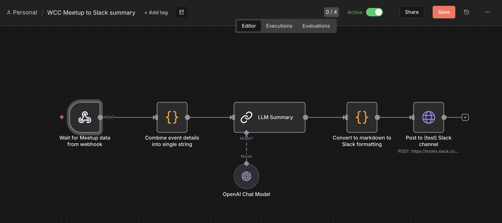

# Project Goal & Background
This project started as a way of testing out an n8n workflow with an LLM component. I wanted to do something that could be useful, so I thought of summarising the upcoming Meetup events for WomenCodingCommunity with an LLM.

The code uses GitHub actions to import the meetup events for WomenCodingCommunity on a twice-weekly basis. The json-formatted data is then sent to n8n using a webhook.

# n8n Automation Flow
